<!--
  Yasar-404 · profile README
  Repo: github.com/Yasar-404/Yasar-404  (special self-titled repo → renders on profile)
  Built as animated SVG assets. No JS, no external icons. See assets/DESIGN.md.
  Sprint 1: hero + foundation. Sprints 2–4 add the tech icon system, dividers, and sections.
-->

<picture>
  <source media="(prefers-color-scheme: dark)"  srcset="./assets/hero-dark.svg">
  <source media="(prefers-color-scheme: light)" srcset="./assets/hero-light.svg">
  
</picture>

&nbsp;

I design and build the same interface — so the thing that ships is the thing that was
designed. UX and product thinking on one side, React and front-of-frontend engineering on
the other, with no handoff gap in between. Recently: a Next.js / Prisma / TypeScript gym
management platform, and a production fitness site down to its own particle hero and SEO schema.

&nbsp;

<picture>
  <source media="(prefers-color-scheme: dark)"  srcset="./assets/stack-dark.svg">
  <source media="(prefers-color-scheme: light)" srcset="./assets/stack-light.svg">
  
</picture>

<picture>
  <source media="(prefers-color-scheme: dark)"  srcset="./assets/philosophy-dark.svg">
  <source media="(prefers-color-scheme: light)" srcset="./assets/philosophy-light.svg">
  
</picture>

<picture>
  <source media="(prefers-color-scheme: dark)"  srcset="./assets/focus-dark.svg">
  <source media="(prefers-color-scheme: light)" srcset="./assets/focus-light.svg">
  
</picture>

<picture>
  <source media="(prefers-color-scheme: dark)"  srcset="./assets/contact-dark.svg">
  <source media="(prefers-color-scheme: light)" srcset="./assets/contact-light.svg">
  
</picture>

  
  &nbsp;
  
  <!-- Email button — replace the address below with yours, then uncomment:
  &nbsp;
  
  -->

<picture>
  <source media="(prefers-color-scheme: dark)"  srcset="./assets/footer-dark.svg">
  <source media="(prefers-color-scheme: light)" srcset="./assets/footer-light.svg">
  
</picture>
